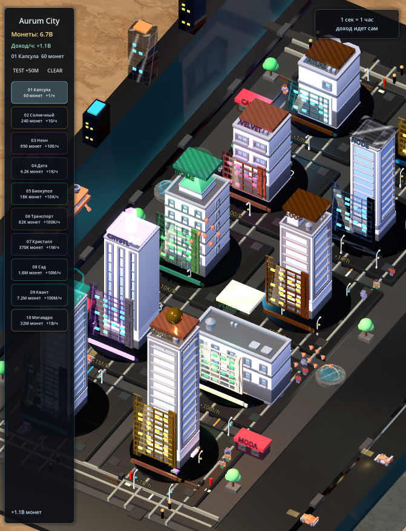

# Godot Mobile Prototype



A vertical mobile game/scene prototype with custom assets, mobile rendering settings and Godot scene structure.

## Demo

- GitHub: https://github.com/KaimiEwl/godot-mobile-prototype
- Live demo: not applicable for this project type
- Video: planned
- Case notes: see `docs/architecture.md`

## What it shows

This project shows game prototyping, Godot project setup, imported assets, scenes and mobile renderer decisions.

## Features

- Mobile portrait viewport settings
- Godot scenes and scripts
- Custom imported assets
- Jolt physics configuration
- Screenshot-backed visual iteration

## Tech stack

- Godot 4.6
- GDScript
- Jolt Physics
- Mobile renderer
- Custom assets

## Local setup

```
Open project.godot in Godot 4.6 or newer.
```

## Verification

```
Open the project in Godot and run the main scene.
```

## Status

Prototype export. Generated editor cache and build outputs are excluded.

## Security and cleanup

This public repository is a clean portfolio export. It intentionally excludes production secrets, local databases, logs, generated media, backups, runtime folders and private deployment artifacts.
